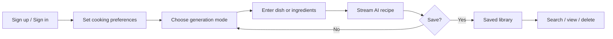

# Bake.me — Product Specification & Roadmap

**Authoritative product document.** Architecture and agent conventions live in [`AGENTS.md`](AGENTS.md). End-user setup remains in [`README.md`](README.md).

**Last reviewed**: 2026-06-19 (from product-improvement run on `dev` branch)

---

## 1. Product Overview

### Product promise

Bake.me is a personal AI chef: describe what you want to cook or list what you have, and get a structured, personalized recipe you can cook from — then save it to your private library.

### Target users

- Home cooks who want inspiration from pantry ingredients.
- People with dietary restrictions, allergies, or disliked ingredients who need recipes that respect those constraints.
- Users who want a simple, signed-in experience (not anonymous generation) with a persistent recipe collection.

### Core workflows

1. **Acquire** — Landing page → sign up (email or Google) or sign in.
2. **Personalize** — Profile: dietary, allergies, dislikes, cuisines, experience, serving size.
3. **Generate** — Pick mode (specific dish vs. ingredients) → submit → watch recipe stream in.
4. **Retain** — Save complete recipe to Firestore; browse/search/delete in Saved Recipes.
5. **Return** — Sign in again; inputs may persist locally; saved recipes load from Firestore.

### Product goals

- **Relevance** — Recipes reflect stated preferences and mode (pantry vs. craving).
- **Trust** — Clear auth, owned data, sanitized rendering, predictable save behavior.
- **Speed** — Streaming generation so users see progress immediately.
- **Simplicity** — Minimal surface area: generate, profile, saved library; no social or meal-planning scope yet.

---

## 2. Current Application State

### What the app does today

Bake.me is a Next.js 16 web application with Firebase Auth + Firestore and OpenAI-powered structured recipe generation via Vercel AI SDK server actions. There are no REST API routes, no mobile app, and no background workers.

### Feature inventory

| Feature | Status | Notes |
|---------|--------|-------|
| Landing + marketing pages | Shipped | `/`, `/about`, `/privacy`, `/terms`, `/support` |
| Email/password auth | Shipped | Remember-me, verification email on signup |
| Google auth | Shipped | Popup flow |
| Password reset | Shipped | `/reset-password` |
| Cooking preferences profile | Shipped | `/profile` — chips, tags, serving size |
| Post-signup profile onboarding | Shipped | Banner on `/generate`; welcome flow at `/profile?welcome=1` |
| Recipe generation (specific dish) | Shipped | Zod-validated input, streaming UI |
| Recipe generation (ingredients) | Shipped | Same pipeline, different prompt |
| Regenerate with optional tweak | Shipped | On `/generate` after first result |
| Serving size adjustment | Shipped | Deterministic scale on `/generate` and saved detail (1–12 servings); saved detail can save a scaled copy |
| AI personalization | Shipped | Profile injected into system prompt |
| Difficulty + times + servings | Shipped | In schema, markdown, and saved docs |
| Tips | Shipped | Optional in generation output |
| Nutrition (calories / macros) | Shipped | `NutritionSummaryPanel` on generate + saved detail; persisted top-level on new saves; legacy saved markdown is parsed on read |
| Authenticated generation | Shipped | `requireAuthenticatedUserId()` gates the server action before OpenAI |
| Server-side generation rate limit | Shipped | In-memory per-user cap (8 requests / 60 seconds / server instance) before OpenAI |
| Save recipe | Shipped | Requires complete structured fields |
| Saved library | Shipped | Search, difficulty/cuisine filters, detail, delete with optimistic UI |
| Route protection (UX) | Shipped | `proxy.ts` cookie/JWT expiry check |
| Firestore security | Shipped | Default-deny; per-user ownership |
| Firebase Storage | Not used | SDK + rules exist; no UI |
| Copy recipe to clipboard | Shipped | `CopyRecipeButton` (markdown incl. macros) on generate + saved detail |
| Recipe sharing (public link) | Not shipped | Clipboard copy only; no public URLs |
| Print / export | Shipped | Print button on generate + saved detail; `@media print` layout |
| Regenerate from saved | Shipped | Saved detail can prefill `/generate` with an editable variation prompt |
| Serving scaling | Shipped | Adjust on `/generate`; saved detail supports display scaling and explicit scaled copy save |
| Shopping list | Not shipped | README aspirational only |
| Meal planning | Not shipped | README aspirational only |
| Automated tests | Partial | 19 Vitest files (97 tests) over pure utils + the proxy matcher invariant |
| CI pipeline | Not shipped | No `.github/workflows` in repo |

### Current user flows (detail)

**Sign up → first generate**
1. User creates account; verification email sent (signup not blocked if unverified — inferred).
2. Redirect to `/generate` (or `?redirect=` target).
3. Mode selector → form → stream → optional save.
4. New users without a profile see an onboarding prompt on `/generate` (skippable).

**Returning user**
1. Auth cookie + Firebase session restored via `AuthListener`.
2. Recipe form inputs may restore from localStorage (`recipe-storage`).
3. Saved recipes fetched client-side with `getUserRecipes` (composite index required).

**Sign out**
1. Cookie cleared, recipe inputs reset, full navigation to `/login`.

### Integrations

| Integration | Usage |
|-------------|--------|
| OpenAI (`gpt-4o`) | Structured recipe generation via `streamObject` |
| Firebase Auth | Email/password, Google |
| Cloud Firestore | `recipes`, `userProfiles` collections |
| Firebase Storage | Initialized only; rules reserved for `users/{userId}/**` |
| Vercel (typical) | Next.js deployment; not configured in repo |

### Architecture summary

- **UI**: App Router; most feature pages are client components using hooks + Zustand.
- **AI**: Single server action `generateRecipe` in `recipe-generation.server.ts`.
- **Data**: Client Firestore SDK; hooks orchestrate reads/writes; Zod validates reads and save payloads.
- **Auth**: Client Firebase Auth + HTTP-only-style cookie for edge proxy; Firestore rules enforce data access.

See [`AGENTS.md`](AGENTS.md) for layer diagram and file map.

### Technical constraints

- Edge proxy cannot verify JWT signatures (no Firebase Admin on Edge).
- Server action `generateRecipe` requires authenticated cookie verified via Firebase REST API.
- Production build requires all `NEXT_PUBLIC_FIREBASE_*` vars; `firebase.ts` throws in production if missing.
- Firestore query `recipes` by `userId` + `orderBy(createdAt desc)` requires a composite index.
- AI schema uses OpenAI strict JSON mode (all fields required in generation schema; nulls for unknown nutrition).
- AGPL-3.0 license affects distribution of modified networked services.

### Known limitations

- **Rate limiting is in-memory per server instance**; there are no durable cross-instance usage quotas or end-user billing controls yet.
- **Saved recipes** store markdown `content` plus structured fields; legacy recipes may lack optional metadata (schema uses `.passthrough()`).
- **Saved-detail scaling depends on structured fields** — older markdown-only saved recipes may not expose scaling controls.
- **Profile onboarding**: First-run banner on `/generate`; skip stored per user in localStorage until profile is saved.
- **Accessibility**: Some patterns present (`aria-live` on recipe display); no audit recorded.

---

## 3. Product Roadmap

Each item is sized for **one focused commit sequence on `dev`** (a single PR-sized change) and ordered by product impact + dependency. Acceptance criteria are testable from a user perspective.

### Recently shipped (do not re-plan)

| Shipped | What |
|---------|------|
| Post-signup preference onboarding | `ProfileOnboardingBanner` → `/profile?welcome=1`; first recipe respects diet/allergies |
| Print-friendly recipe view | `PrintRecipeButton` + `@media print` on generate + saved detail |
| Regenerate / refine | Optional tweak + Regenerate on `RecipeDisplay` |
| Serving-size adjustment (generate) | `scaleRecipeServings` 1–12 on `RecipeDisplay` |
| Nutrition summary panel | `NutritionSummaryPanel` on generate + saved detail; persisted on new saves |
| Authenticated AI generation | `requireAuthenticatedUserId()` gates `generateRecipe` before OpenAI |
| Copy recipe to clipboard | `CopyRecipeButton` + `buildRecipeCopyText` (markdown incl. macros) on generate + saved detail |
| Legacy nutrition backfill | Saved detail parses nutrition from legacy markdown content when top-level nutrition fields are missing |
| Saved-library serving adjustment | Saved detail can rescale a modern structured recipe and save a scaled copy |
| Session generation history | `/generate` keeps the last 5 complete generated recipes in memory only |
| Server-side generation rate limit | Authenticated generation is capped before OpenAI is called |
| Refine from saved recipe | Saved detail can open `/generate` with an editable variation prompt |
| Saved-library metadata filters | Saved library filters by difficulty and cuisine alongside text search |

---

### Next

No approved active roadmap items remain after the 2026-06-19 product-improvement
run. Future candidates should be proposed through the product-improvement
workflow before implementation.

---

### Deferred (not next — README aspirational)

These are **not** current roadmap commitments unless product scope expands:

- Meal planning calendar
- Shopping list generation
- Public recipe community
- Mobile native app
- Voice-guided cooking
- Smart appliance integration
- Unit conversion (metric/imperial) as a standalone toggle — could extend the serving-scale utility

---

## Document maintenance

When shipping a milestone, update the **Feature inventory** table and move the item out of the roadmap. Agent and architecture changes go to [`AGENTS.md`](AGENTS.md) only.
