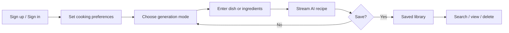

# Bake.me — Product Specification & Roadmap

**Authoritative product document.** Architecture and agent conventions live in [`AGENTS.md`](AGENTS.md). End-user setup remains in [`README.md`](README.md).

**Last reviewed**: 2026-05-26 (from codebase inspection on `dev` branch)

---

## 1. Product Overview

### Product promise

Bake.me is a personal AI chef: describe what you want to cook or list what you have, and get a structured, personalized recipe you can cook from — then save it to your private library.

### Target users

- Home cooks who want inspiration from pantry ingredients.
- People with dietary restrictions, allergies, or disliked ingredients who need recipes that respect those constraints.
- Users who want a simple, signed-in experience (not anonymous generation) with a persistent recipe collection.

### Core workflows

1. **Acquire** — Landing page → sign up (email or Google) or sign in.
2. **Personalize** — Profile: dietary, allergies, dislikes, cuisines, experience, serving size.
3. **Generate** — Pick mode (specific dish vs. ingredients) → submit → watch recipe stream in.
4. **Retain** — Save complete recipe to Firestore; browse/search/delete in Saved Recipes.
5. **Return** — Sign in again; inputs may persist locally; saved recipes load from Firestore.

### Product goals

- **Relevance** — Recipes reflect stated preferences and mode (pantry vs. craving).
- **Trust** — Clear auth, owned data, sanitized rendering, predictable save behavior.
- **Speed** — Streaming generation so users see progress immediately.
- **Simplicity** — Minimal surface area: generate, profile, saved library; no social or meal-planning scope yet.

---

## 2. Current Application State

### What the app does today

Bake.me is a Next.js 16 web application with Firebase Auth + Firestore and OpenAI-powered structured recipe generation via Vercel AI SDK server actions. There are no REST API routes, no mobile app, and no background workers.

### Feature inventory

| Feature | Status | Notes |
|---------|--------|-------|
| Landing + marketing pages | Shipped | `/`, `/about`, `/privacy`, `/terms`, `/support` |
| Email/password auth | Shipped | Remember-me, verification email on signup |
| Google auth | Shipped | Popup flow |
| Password reset | Shipped | `/reset-password` |
| Cooking preferences profile | Shipped | `/profile` — chips, tags, serving size |
| Post-signup profile onboarding | Shipped | Banner on `/generate`; welcome flow at `/profile?welcome=1` |
| Recipe generation (specific dish) | Shipped | Zod-validated input, streaming UI |
| Recipe generation (ingredients) | Shipped | Same pipeline, different prompt |
| AI personalization | Shipped | Profile injected into system prompt |
| Difficulty + times + servings | Shipped | In schema, markdown, and saved docs |
| Tips | Shipped | Optional in generation output |
| Calories / macros | Partial | Generated when model provides; shown in markdown only |
| Save recipe | Shipped | Requires complete structured fields |
| Saved library | Shipped | Search, detail, delete with optimistic UI |
| Route protection (UX) | Shipped | `proxy.ts` cookie/JWT expiry check |
| Firestore security | Shipped | Default-deny; per-user ownership |
| Firebase Storage | Not used | SDK + rules exist; no UI |
| Recipe sharing | Not shipped | — |
| Print / export | Shipped | Print button on generate + saved detail; `@media print` layout |
| Regenerate from saved | Not shipped | — |
| Serving scaling | Not shipped | Profile has default size; no adjust-after-generate |
| Shopping list | Not shipped | README aspirational only |
| Meal planning | Not shipped | README aspirational only |
| Automated tests | Partial | Vitest unit tests for auth/route/onboarding utils |
| CI pipeline | Not shipped | No `.github/workflows` in repo |

### Current user flows (detail)

**Sign up → first generate**
1. User creates account; verification email sent (signup not blocked if unverified — inferred).
2. Redirect to `/generate` (or `?redirect=` target).
3. Mode selector → form → stream → optional save.
4. New users without a profile see an onboarding prompt on `/generate` (skippable).

**Returning user**
1. Auth cookie + Firebase session restored via `AuthListener`.
2. Recipe form inputs may restore from localStorage (`recipe-storage`).
3. Saved recipes fetched client-side with `getUserRecipes` (composite index required).

**Sign out**
1. Cookie cleared, recipe inputs reset, full navigation to `/login`.

### Integrations

| Integration | Usage |
|-------------|--------|
| OpenAI (`gpt-4o`) | Structured recipe generation via `streamObject` |
| Firebase Auth | Email/password, Google |
| Cloud Firestore | `recipes`, `userProfiles` collections |
| Firebase Storage | Initialized only; rules reserved for `users/{userId}/**` |
| Vercel (typical) | Next.js deployment; not configured in repo |

### Architecture summary

- **UI**: App Router; most feature pages are client components using hooks + Zustand.
- **AI**: Single server action `generateRecipe` in `recipe-generation.server.ts`.
- **Data**: Client Firestore SDK; hooks orchestrate reads/writes; Zod validates reads and save payloads.
- **Auth**: Client Firebase Auth + HTTP-only-style cookie for edge proxy; Firestore rules enforce data access.

See [`AGENTS.md`](AGENTS.md) for layer diagram and file map.

### Technical constraints

- Edge proxy cannot verify JWT signatures (no Firebase Admin on Edge).
- Server action `generateRecipe` requires authenticated cookie verified via Firebase REST API.
- Production build requires all `NEXT_PUBLIC_FIREBASE_*` vars; `firebase.ts` throws in production if missing.
- Firestore query `recipes` by `userId` + `orderBy(createdAt desc)` requires a composite index.
- AI schema uses OpenAI strict JSON mode (all fields required in generation schema; nulls for unknown nutrition).
- AGPL-3.0 license affects distribution of modified networked services.

### Known limitations

- **Documentation drift**: Root `README.md` still describes obsolete paths (`lib/actions.ts`, `lib/db.ts`); use `AGENTS.md` / this file instead.
- **No rate limiting** beyond 500ms client debounce on generate submit.
- **No usage quotas** or billing for end users.
- **Saved recipes** store markdown `content` plus structured fields; legacy recipes may lack optional metadata (schema uses `.passthrough()`).
- **Branding inconsistency**: Some assets/alt text still say "BakeMe.ai" (e.g. landing image alt).
- **No `.env.example`** committed (`.env*` gitignored); setup documented in README only.
- **Profile onboarding**: First-run banner on `/generate`; skip stored per user in localStorage until profile is saved.
- **Accessibility**: Some patterns present (`aria-live` on recipe display); no audit recorded.

---

## 3. Product Roadmap

Ordered by product impact and dependency. Each item is sized for one focused commit sequence on `dev`. Acceptance criteria are testable from a user perspective.

---

### Milestone 1 — Post-signup preference onboarding ✅

**Status**: Shipped (2026-05-26)

**User value**: First recipe reflects allergies and diet without hunting for Profile.

**Implementation note**: `ProfileOnboardingBanner` on `/generate` when no `userProfiles/{uid}` doc exists; skip persisted in localStorage per user. “Set up preferences” links to `/profile?welcome=1` with welcome copy and “Save and start cooking” redirect back to `/generate`. Profile save updates `user-profile-store` so generation uses new preferences immediately.

**Acceptance criteria** (verified):
- [x] New user sees onboarding prompt once before or on first visit to `/generate`.
- [x] Completing onboarding persists profile and subsequent generations use it.
- [x] Skip path lands on generate with unchanged behavior for users without profile.

---

### Milestone 2 — Print-friendly recipe view ✅

**Status**: Shipped (2026-05-26)

**User value**: Cook from a saved or generated recipe on paper or tablet without chrome.

**Implementation note**: `PrintRecipeButton` on `RecipeDisplay` (after stream completes) and `RecipeDetail`. Global `@media print` rules in `globals.css` isolate `.recipe-printable` content (title + markdown) and hide nav, actions, and sidebar via visibility scoping.

**Acceptance criteria** (verified):
- [x] Print from generated recipe (after stream completes) and from saved detail.
- [x] Output excludes nav, buttons, and site chrome.
- [x] Markdown content renders readably in print layout.

---

### Milestone 3 — Regenerate and refine

**User value**: Iterate on a recipe without retyping the whole prompt.

**Intent**: Add "Regenerate" on generate page (same inputs) and optional "Tweak" field ("make it spicier", "serve 2") appended to prompt; preserve mode and inputs.

**Acceptance criteria**:
- Regenerate clears prior save state and streams new recipe.
- Tweak text is optional; empty regenerate uses original prompt only.
- Abort/cancel behavior matches existing generation hook.

**Depends on**: `useRecipeGeneration`, recipe store reset semantics.

---

### Milestone 4 — Serving size adjustment

**User value**: Change servings after generation to match household size.

**Intent**: UI control on `RecipeDisplay` to scale ingredient quantities (deterministic multiplier from current servings to target, or secondary AI call — prefer deterministic first).

**Acceptance criteria**:
- User selects target servings (1–12, aligned with profile defaults).
- Ingredient list updates; instructions note adjusted quantities where applicable.
- Save persists scaled version user confirms.

**Depends on**: Structured `ingredients` array; may need parsing heuristics for quantities in strings.

---

### Milestone 5 — Nutrition summary panel

**User value**: See calories and macros at a glance when the model provides them.

**Intent**: When `calories` / `macros` exist on `structuredRecipe`, render a compact summary card above markdown (generate + saved detail); do not block save when null.

**Acceptance criteria**:
- Panel visible when data present; hidden when all null.
- Saved recipes show panel when structured fields exist on document (may require backfill from markdown for legacy — optional).

**Depends on**: Existing schema fields; mostly UI.

---

### Milestone 6 — Copy / share recipe (private link deferred)

**User value**: Share a recipe with a friend via clipboard.

**Intent**: "Copy recipe" exports plain-text or markdown to clipboard from generate and saved views; no public URLs in v1.

**Acceptance criteria**:
- One click copies full recipe text.
- Success feedback (toast or inline).
- Copied content matches displayed recipe.

**Depends on**: `convertToMarkdown` / display selectors.

**Out of scope for this milestone**: Public sharing, Firebase Storage images.

---

### Milestone 7 — Secure AI generation (authenticated server action) ✅

**Status**: Shipped (2026-05-26) — prior dev stabilization pass

**User value**: Platform sustainability and user trust — only signed-in users consume AI.

**Implementation note**: `requireAuthenticatedUserId()` in `generateRecipe` verifies auth cookie via Firebase Identity Toolkit REST API (with unsigned fallback in dev only).

**Acceptance criteria** (verified):
- [x] Unauthenticated server action invocation fails without calling OpenAI.
- [x] Signed-in user's generate flow unchanged.
- [x] Error message surfaced via existing generation error path.

---

### Milestone 8 — Generation history (session)

**User value**: Compare last few generations before saving one.

**Intent**: Keep in-memory (or sessionStorage) list of last N `structuredRecipe` snapshots on generate page; select to restore display without re-calling AI.

**Acceptance criteria**:
- Up to 5 recent generations listed while on `/generate`.
- Selecting one updates display; save works on selected snapshot.
- Clearing on sign-out or explicit "Clear history".

**Depends on**: Recipe store extension (do not persist to localStorage long-term).

---

### Deferred (not next — README aspirational)

These are **not** current roadmap commitments unless product scope expands:

- Meal planning calendar
- Shopping list generation
- Public recipe community
- Mobile native app
- Voice-guided cooking
- Smart appliance integration
- Unit conversion (metric/imperial) as standalone — may fold into Milestone 4

---

## Document maintenance

When shipping a milestone, update the **Feature inventory** table and move the item out of the roadmap. Agent and architecture changes go to [`AGENTS.md`](AGENTS.md) only.
